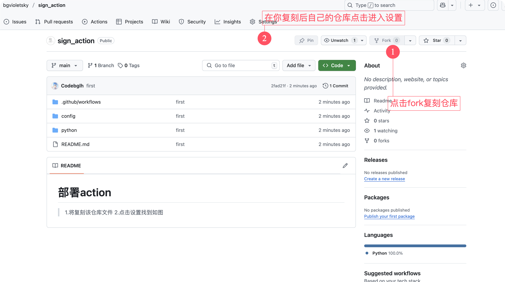
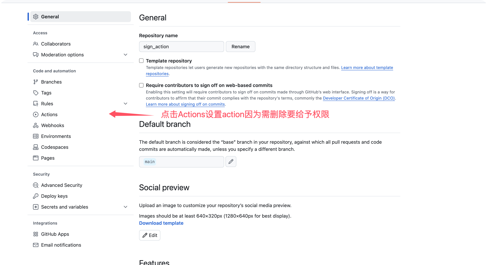
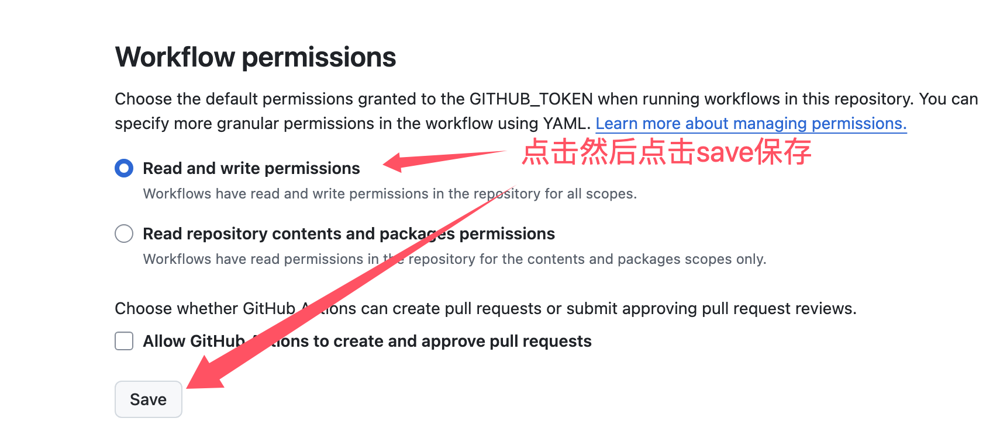
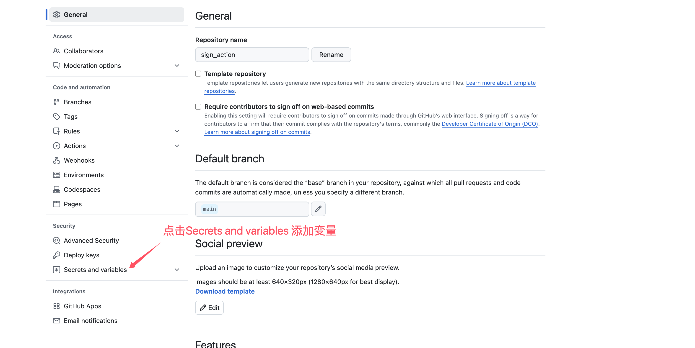
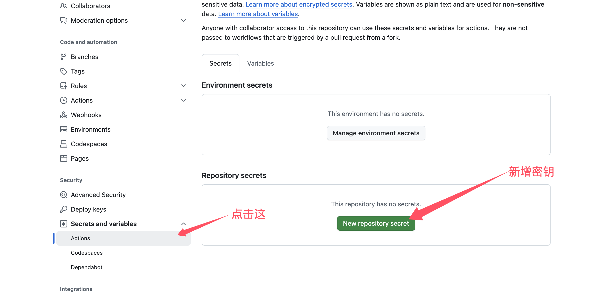
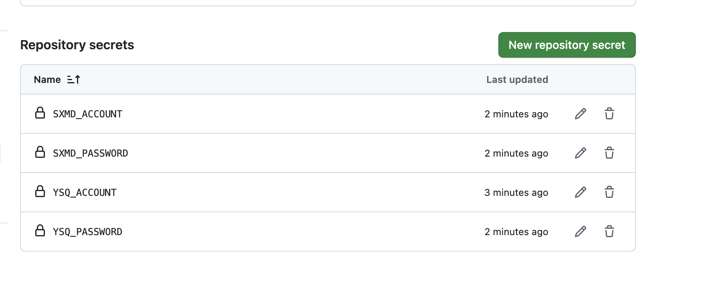

<!--
 * @Author: bgcode
 * @Date: 2025-03-27 09:47:13
 * @LastEditTime: 2025-03-30 13:16:01
 * @LastEditors: bgcode
 * @Description: 描述
 * @FilePath: /sign_action/README.md
 * 本项目采用GPL 许可证，欢迎任何人使用、修改和分发。
-->
# 书香门第签到
# 源社区签到

# 部署action
> 1.将复刻该仓库文件

> 2.如图

> 如果不需要书香门第签到，则无需添加相关数据可以自行添加需要签到的网站脚本到python文件夹在修改.github/workflows/文件夹中sign.yml文件内容即可

